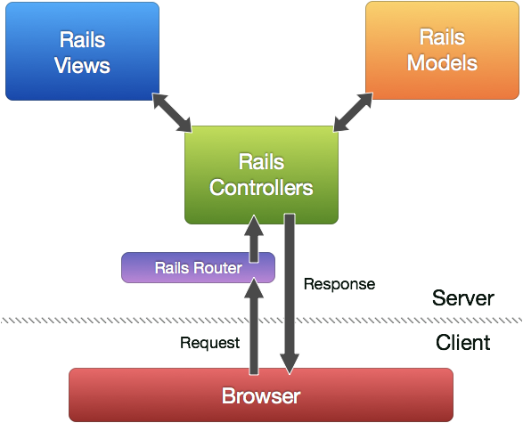

# Les concepts de base  de ruby on rails
Ce fichier propose quelques explications sur les concepts de bases de ruby on rails. Les explications prennent les concepts dans le cadre générale et ne remettent pas forcement les concepts dans le contexte de ruby on rails.

#### Sommaire

* [La différence entre un site statique et un site dynamique](#d_stat_dy)
* [Le MVC](#mvc)
* [Les routes](#routes)
* [Les Bases de Données](#bdd)
* [GET / POST](#getPost)
* [Le concept de migration](#migration)
* [Les relations entre les models des BDD](#relations_bdd)
* [Les fonctions du CRUD](#crud)

### <a name="d_stat_dy">La différence entre un site statique et un site dynamique</a>
En fonction des échanges qu'un site peut avoir avec ses utilisateurs, il est statique ou dynamique.

**Statique** : le site ne requiert pas d'informations de la part de l'utilisateur et une page ne peut offrir qu'un affichage unique. On peut faire une analogie avec une constante en programmation. [Exemple de page statique](http://194.199.252.232/moteurs/aidenligne/pages/liens-excel.htm).

**Dynamique**: le site interpelle l'utilisateur pour récupérer des informations, et réagit différemment en fonction de ce qu'il reçoit de l'utilisateur. Ainsi une même page peut avoir plusieurs affichages différents(si l'utilisateur se connecte ou pas par exemple). On peut faire une analogie avec une variable en programmation dont la valeur peut changer. Exemple: page d’accueil de [Youtube](https://www.youtube.com/) qui change en fonction de si on est loggé ou pas.

### <a name="mvc">Le MVC</a>
MVC (Model, View, Controler) est l'architecture des applications Rails. Chaque appli Rails est constitué de:
* **modèles (Model)** qui communiquent avec la BDD et permettent de recuperer ou d'inserer des eléments.
* **vues (view)** qui sont des visuels de sites web présentés à l’utilisateur et qui constituent l'interface entre le programme et l'utilisateur.
* <a name= "ctr">**controlleur (controller)**</a> qui peuvent être comparé à des robots qui font un travail **précis** à l’intérieur de l'ordinateur. Ces robots sont contactés par un message provenant de l'interface qui est appelé **route**. Ils vont ensuite aller passer par le décodage des *modèles* pour récupérer des données dans la BDD puis récupérer un affichage en fonction des données récupérés dans les *vues* et enfin, transmettre cet affichage à l'interface qui va le présenter à l'utilisateur.

### <a name="routes">Les routes</a>
Les **routes** peuvent être considérés comme des messages qui vont être transmis à un [robot(controller) précis](#ctr). Chaque *route* induit l'activité d'un *controller* précis qui va déclencher une cascades d'actions précises. Cette [page web](http://guides.rubyonrails.org/routing.html) approfondit bien le concept.

### <a name="bdd">Les Bases de Données</a>
Les bases de données (BDD) permettent d'enregistrer les informations d'un site web pour pouvoir le récupérer plus tard. Les [principales bases de données](https://openclassrooms.com/courses/concevez-votre-site-web-avec-php-et-mysql/presentation-des-bases-de-donnees-2) sont **MySQL**, **PostgreSQL**, **oracle**, **SQLServer**, **SQLite**.Ils sont comparables à des tableur Excel géants. Pour dialoguer avec ces BDD il faut utiliser le language [Sql](https://fr.wikipedia.org/wiki/Structured_Query_Language) et émettre des instructions qui sont appelées des **requêtes**. [Quelques exemples de requêtes](http://www.sqlfacile.com/apprendre_bases_de_donnees/sql_par_l_exemple_1).

### <a name="getPost">GET / POST</a>

GET et POST sont deux méthodes de requête-réponse entre le client et le server dans le protocole **HTTP**. HTTP(Hypertext Transfer Protocol) à été crée pour permettre la communication entre un client et le serveur. Un navigateur peut être le client et une application sur un ordinateur qui héberge un site web, le server.

#### Quelques differences entre GET et POST
GET   | POST          
--- | ---
paramètres dans l'**url** | paramètres dans **body**
limitation de longueur | pas de limitation de longueur
gardé dans le cache | pas gardé dans le cache

Voici [une page](https://www.w3schools.com/tags/ref_httpmethods.asp) qui approfondit ces méthodes.

### <a name="migration">Le concept de migration</a>
La conception d'un site web se fait la plus part de temps en local. Le programme interagis avec une base de données(BDD) local et toutes les modifications que le programme fera à la BDD locale seront a refaire lorsque qu'on mettra le site en ligne. C'est là qu'interviennent  **les migrations**.

Une migration comporte un schema et des changements qui sont indépendants de la BDD et qui sont ainsi **transportable** à toute les autres BDD. Elles sont écrites avec la syntaxe de Ruby ce qui ce qui peut faciliter la tâche par raport au requete SQL. [Page](http://guides.rubyonrails.org/v3.2/migrations.html) qui explique le concept plus en profondeur.

### <a name="relations_bdd">Les relations entre les models des BDD</a>
Une relation est un lien entre deux tables de [BDD](#bdd),qui associe les données de la première avec celle de la deuxième.
* les relations peuvent s'établir d'un enregistrement à un seul autre (**1 à 1**). Exemple : Deux tables contenant l'une les informations civile des utilisateurs, et l'autre ,les informations médicales, ont un lien unique qui est l'identifiant des clients.
* d'un enregistrement à plusieurs autre (**1 à ∞**). Exemple: Un article peut avoir plusieurs commentaires, mais un commentaire n'est lié qu'a un article.
* de plusieurs enregistrement à plusieurs autres( de **∞ à ∞**). Exemple: un produit peut avoir plusieurs vendeur et un vendeur peut vendre plusieurs produits.

### <a name="crud">Les fonctions du CRUD</a>
L'acronyme CRUD (**Create** ou création,**Read** ou lecture, **Update** ou modification, **Delete** ou suppression) indique les 4 opérations de base pour gérer tout type de données. Chaque fonctions est importantes et s'il en manque un dans un logiciel, celui ci est incopmplet. Chaque composante du CRUD peut être associée à un type de requête SQL ainsi qu'à une methode HTTP.

| Operation      | SQL          | HTTP |
| ------------- |:-------------:| -----:|
|Create         |INSERT         |POST |
|Read (Retrieve)   |SELECT     |GET |
|Update (Modify) |UPDATE      |PUT |
|Delete (Destroy)|DELETE      |DELETE |

---
Écrit par arnold_domaya/Slack:@domaya_arnold
